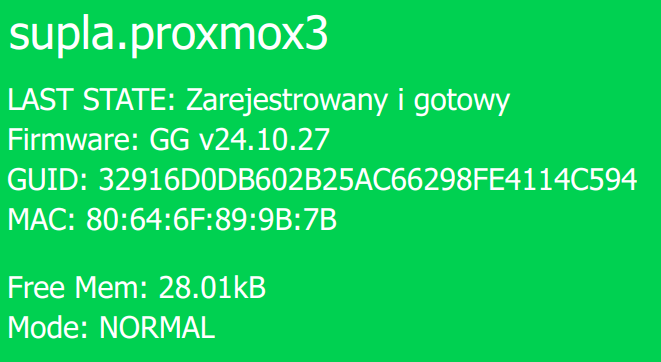
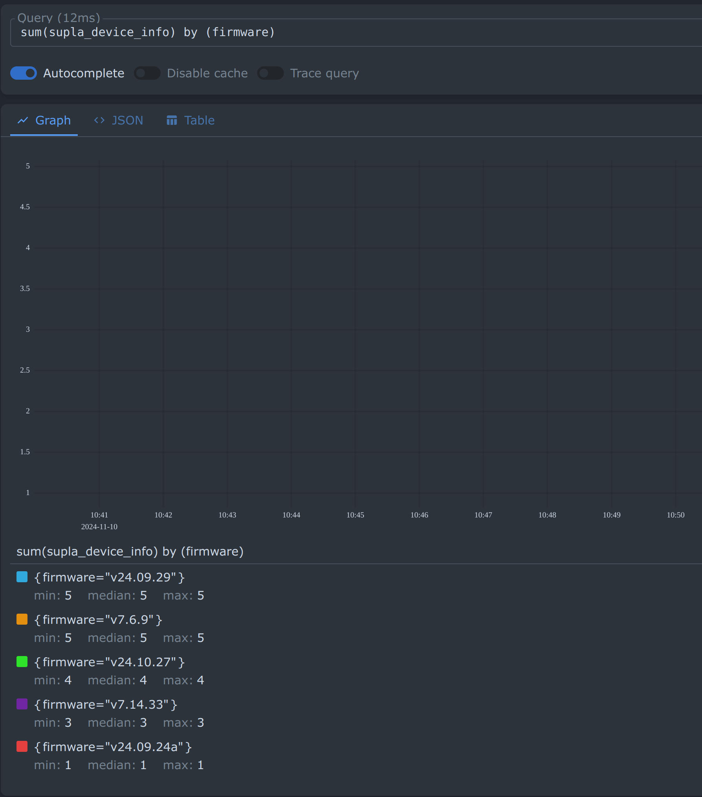

# Supla GG Device Monitoring

<!-- TOC -->

- [Supla GG Device Monitoring](#supla-gg-device-monitoring)
  - [Features](#features)
  - [Installation](#installation)
  - [Configuration](#configuration)
  - [Usage](#usage)
    - [Docker Compose](#docker-compose)
    - [Docker](#docker)
    - [Prometheus job example](#prometheus-job-example)
  - [Metrics](#metrics)
    - [Prometheus query examples](#prometheus-query-examples)
  - [Logging](#logging)
  - [Project Structure](#project-structure)
  - [Contributing](#contributing)
  - [License](#license)

<!-- /TOC -->

This project is a Prometheus exporter for monitoring Supla Generic Builder [https://gui-generic-builder.supla.io/](https://gui-generic-builder.supla.io/) devices. It fetches information from web pages of Supla devices, parses the data, and exposes it as Prometheus metrics. The exporter can handle multiple devices and provides various metrics including device availability, free memory, and device information.
This exporter will be working `ONLY` with Generic Builder devices, not with the original Supla devices.



## Features

- Monitor multiple Supla devices simultaneously
- Expose device metrics for Prometheus scraping
- Configurable update interval and timeout
- Basic authentication support for device communication
- Detailed logging with configurable log levels
- Graceful handling of various HTTP errors and network issues

## Installation

1. Ensure you have Go installed on your system (version 1.15 or later recommended).
2. Clone the repository:

   ```bash
   git clone https://github.com/yourusername/supla-device-monitoring.git
   ```

3. Navigate to the project directory:

   ```bash
   cd supla-device-monitoring
   ```

4. Build the project:

   ```bash
   go build -o supla-exporter
   ```

## Configuration

The application uses a YAML configuration file. By default, it looks for `config/config.yaml`, but you can specify a different path using the `-config` flag.

Example configuration:

```yaml
global:
  interval: 60 # Update interval in seconds
  timeout: 5 # Global timeout for HTTP requests in seconds
  port: 2112 # Port for the metrics server
  log_level: "info" # Log level (debug, info, warn, error)
  log_format: "logfmt" # Log format (logfmt, json)
  workers: 5 # Number of workers for parsing web pages

devices:
  - url: "http://192.168.1.100"
    username: "user1"
    password: "pass1"
  - url: "http://192.168.1.101"
    username: "user2"
    password: "pass2"
```

## Usage

Run the exporter:

```bash
./supla-exporter -config /path/to/your/config.yaml
```

The exporter will start fetching data from the configured devices and expose metrics on the specified port (default: 2112).

Access metrics:

```bash
http://localhost:2112/metrics
```

### Docker Compose

```yaml
services:
  supla_exporter:
    image: marcinbojko/supla_exporter:${SUPLA_EXPORTER_TAG}
    container_name: supla_exporter
    restart: unless-stopped
    expose:
      - 2112
    volumes:
      - ./supla/config.yaml:/config.yaml
```

### Docker

```bash
docker run -d -p 2112:2112 -v /path/to/your/config.yaml:/config.yaml marcinbojko/supla_exporter:${SUPLA_EXPORTER_TAG}
```

### Prometheus job example

```yaml
# Supla exporter
- job_name: "supla_exporter"
  static_configs:
    - targets:
        - "supla_exporter:2112"
      labels:
        app: "supla_exporter"
        env: "home"
        team: "home"
  metrics_path: /metrics
  scheme: http
  honor_labels: true
  honor_timestamps: true
```

## Metrics

The exporter provides the following metrics:

| Name                             | Description                                        | Labels                    |
| -------------------------------- | -------------------------------------------------- | ------------------------- |
| `supla_device_info`              | Base device information indicating device presence | `url`, `name`             |
| `supla_device_state`             | Device operational state                           | `url`, `state`            |
| `supla_device_network`           | Device network information                         | `url`, `mac`              |
| `supla_device_firmware`          | Device firmware version                            | `url`, `firmware`, `name` |
| `supla_device_memory_free_bytes` | Free memory in bytes                               | `url`, `name`             |
| `supla_device_up`                | Device availability status (1=up, 0=down)          | `url`                     |
| `supla_device_count`             | Total number of Supla devices                      | -                         |

### Prometheus query examples

Get all devices that are currently up:

```promql
supla_device_up == 1
```

Get firmware versions for all devices:

```promql
supla_device_firmware
```



```promql
sum(supla_device_firmware) by (firmware)
```

## Logging

The application uses structured logging with configurable log levels. Set the desired log level in the configuration file:

- `debug`: Verbose logging, including detailed device information
- `info`: General operational information
- `warn`: Warnings and non-critical issues
- `error`: Error conditions

Log format can also be configured to either `logfmt` or `json` for better integration with logging systems.

## Project Structure

- `main.go`: Entry point of the application
- `config/`: Configuration loading and structures
- `metrics/`: Prometheus metric definitions and update logic
- `parser/`: HTML parsing and device information extraction

## Contributing

Contributions are welcome! Please feel free to submit a Pull Request.

## License

LGPL-3.0
